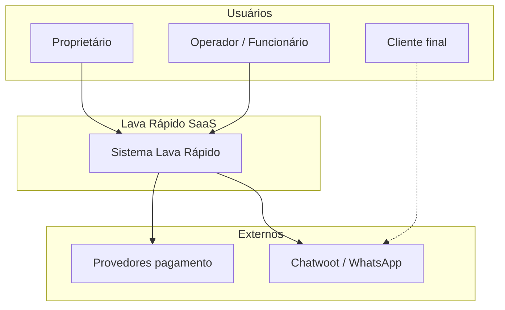
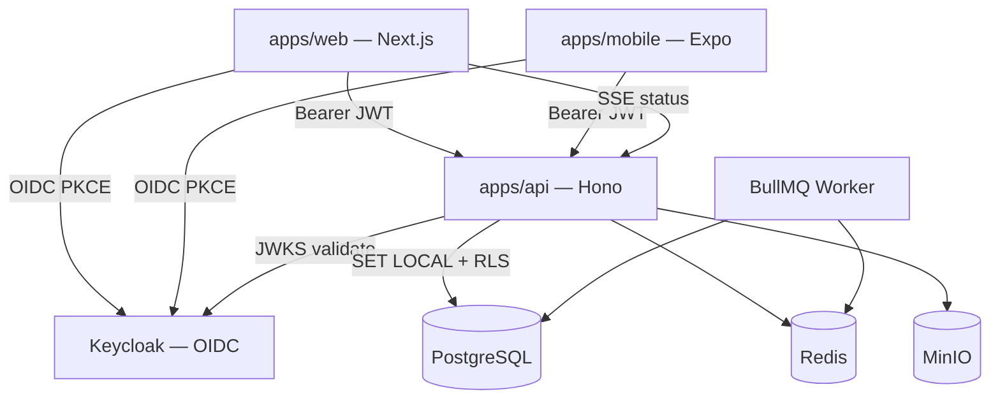

# Architecture Decision Document — Lava Rápido

SaaS multi-tenant para gestão de lava-rápido automotivo. Escala alvo: **1000+ tenants**. Infra self-hosted (Docker Swarm → K8s).

---

## 1. Visão geral

| Atributo | Decisão |
|----------|---------|
| Modelo | SaaS multi-tenant; **1 Tenant = conta do dono; 1+ Filiais (pontos)** |
| Isolamento | PostgreSQL RLS + `tenant_id`; escopo operacional por `branch_id` |
| Auth | Keycloak OIDC — **sem auth custom** |
| API | Hono (TypeScript), REST `/v1/*` |
| Frontends | Next.js (web) + Expo (mobile) — **sem acesso direto ao banco** |
| Storage | MinIO (S3-compatible) |
| Cache/filas | Redis + BullMQ |
| Realtime | SSE/WebSocket na API + Redis pub/sub |
| Deploy | Front (CDN) ≠ API/IdP/dados (Swarm/K8s) |

---

## 2. Diagrama de contexto (C4 L1)



---

## 3. Diagrama de containers (C4 L2)



---

## 4. ADRs (Architecture Decision Records)

### ADR-001 — Multi-tenant: RLS + tenant_id

**Status:** Aceito  
**Contexto:** Isolamento forte sem operação de 1000 DBs/schemas.  
**Decisão:** Schema compartilhado; coluna `tenant_id` em toda tabela de negócio; RLS via `current_setting('app.tenant_id')`. Operações (board, caixa, entries) também usam `branch_id` — filtro na API + coluna em registros operacionais.  
**Consequências:** API executa `SET LOCAL app.tenant_id` por transação; queries operacionais filtram `branch_id` (header `X-Branch-Id` ou claim JWT); CI com teste cross-tenant e cross-branch.

### ADR-002 — Auth: Keycloak (não custom)

**Status:** Aceito  
**Decisão:** Keycloak self-hosted; clients `lava-rapido-web`, `lava-rapido-mobile`; claims JWT `tenant_id`, `branch_ids[]` (filiais permitidas), `default_branch_id`. Admin vê todas as filiais do tenant; operador vê só filiais atribuídas.  
**Bibliotecas:** Web — Auth.js Keycloak provider; Mobile — `react-native-app-auth`; API — `jose` + JWKS.

### ADR-003 — Front/back separados

**Status:** Aceito  
**Decisão:** Frontends só consomem API REST; zero SDK de banco no browser/app.

### ADR-004 — ORM: Drizzle

**Status:** Aceito  
**Decisão:** Drizzle ORM na API — leve, TypeScript-first, SQL transparente para RLS.

### ADR-005 — Realtime: SSE + Redis

**Status:** Aceito  
**Decisão:** `GET /v1/events/stream` (SSE) por tenant **e filial ativa**; pub/sub Redis `t:{tenant_id}:b:{branch_id}:status`.

### ADR-006 — UI única minimalista

**Status:** Aceito (revisão brainstorming)  
**Decisão:** **Rejeitar Modo Pista automático.** Home = board; 3–4 CTAs sempre; fila = badge.

### ADR-007 — Pagamentos desacopláveis

**Status:** Aceito  
**Decisão:** Adapter pattern; modo manual always-on; webhooks idempotentes (Redis).

### ADR-008 — Supabase removido

**Status:** Aceito  
**Decisão:** Postgres + Keycloak + MinIO self-hosted.

### ADR-009 — Multi-filial: branch_id

**Status:** Aceito (2026-05-21)  
**Contexto:** Donos podem ter 1 ou N pontos; visão consolidada + individual.  
**Decisão:** Entidade `branches`; `branch_id NOT NULL` em `vehicle_entries`, `payments`, `expenses`; catálogo (`wash_types`, `customers`) permanece no nível Tenant no MVP. Visão consolidada = agregação API (SUM/GROUP BY branch).  
**Consequências:** Seletor Filial/Consolidado no web; operador mobile com filial fixa ou seletor se multi-acesso; onboarding cria 1 filial default.

---

## 5. Fluxo de autenticação

```
1. Web/Mobile → Keycloak login (Authorization Code + PKCE)
2. Keycloak → access_token (claims: sub, tenant_id, branch_ids[], default_branch_id, roles)
3. Client → API com Authorization: Bearer <token> + header X-Branch-Id (filial ativa)
4. API middleware:
   a. jose.jwtVerify(token, JWKS)
   b. extrai tenant_id, branch_ids, user_id, roles
   c. valida X-Branch-Id ∈ branch_ids (ou admin = todas do tenant)
   d. SET LOCAL app.tenant_id = '<uuid>'
5. Drizzle query → RLS aplica filtro tenant; handler filtra branch_id quando aplicável
```

**Degraded mode (P0):** mobile cache JWT ~15min; operações offline enfileiram; login novo bloqueado se Keycloak down.

---

## 6. Modelo de dados (MVP)

```sql
-- tenants (sem RLS — só service/admin)
tenants (id, name, slug, plan, created_at)

-- filiais (pontos físicos) — RLS por tenant_id
branches (id, tenant_id, name, address, active, created_at)
employee_branches (employee_id, branch_id)  -- operador ↔ filiais permitidas

-- catálogo e CRM no nível Tenant (MVP)
customers (id, tenant_id, name, phone, whatsapp_opt_in, ...)
wash_types (id, tenant_id, name, price_cents, duration_min, active, ...)

-- operação e financeiro scoped por filial
vehicle_entries (id, tenant_id, branch_id, plate, customer_id, wash_type_id,
                 status, notes, created_at, ready_at, ...)
employees (id, tenant_id, keycloak_user_id, name, role, commission_pct, ...)
payments (id, tenant_id, branch_id, vehicle_entry_id, amount_cents, method, provider, ...)
expenses (id, tenant_id, branch_id, category, amount_cents, ...)
```

**Status enum:** `preparation` | `washing` | `finishing` | `ready`

**RLS template:**

```sql
ALTER TABLE customers ENABLE ROW LEVEL SECURITY;
CREATE POLICY tenant_isolation ON customers
  USING (tenant_id = current_setting('app.tenant_id', true)::uuid);
```

---

## 7. API — rotas MVP (v1)

| Método | Rota | Descrição |
|--------|------|-----------|
| GET | `/health` | Liveness |
| GET | `/ready` | Readiness (PG + Redis) |
| GET | `/v1/events/stream` | SSE board status (por filial) |
| CRUD | `/v1/branches` | Filiais do Tenant |
| GET | `/v1/cash-register` | Caixa (query `?branch_id=` ou `consolidated=true`) |
| CRUD | `/v1/vehicle-entries` | Operações (scoped branch) |
| PATCH | `/v1/vehicle-entries/:id/status` | Pipeline |
| CRUD | `/v1/customers` | Clientes |
| CRUD | `/v1/wash-types` | Catálogo |
| POST | `/v1/payments` | Pagamento manual/integrado |
| POST | `/v1/uploads/presign` | URL MinIO |
| POST | `/v1/sync/batch` | Offline mobile (Fase 2) |
| POST | `/v1/webhooks/stripe` | Webhook (Fase 3) |

**Erro padrão:** `{ "error": { "code": "...", "message": "..." } }` (português).

**Middleware chain:** `requestId` → `auth` → `tenantContext` → `branchContext` → `rbac` → `handler`

---

## 8. Estrutura do monorepo

```
lava-rapido/                    # repo root (migrar gradualmente)
├── apps/
│   ├── web/                    # Next.js 16 + shadcn
│   ├── api/                    # Hono + Drizzle
│   └── mobile/                 # Expo (Fase 2)
├── packages/
│   ├── shared/                 # Zod, tipos, enums status
│   ├── api-contract/           # DTOs + path constants
│   └── api-client/             # fetch tipado
├── infra/
│   └── docker/
│       ├── docker-compose.yml
│       └── keycloak/           # realm export (futuro)
├── turbo.json
└── lava-rapido/                # BMAD tooling
    └── _bmad-output/
```

**Mapeamento épicos → módulos API:**

| Epic | Módulo `apps/api/src/` |
|------|-------------------------|
| E1 Fundação | `middleware/`, `db/`, `modules/tenants/`, `modules/branches/` |
| E2 Operações | `modules/vehicle-entries/`, `modules/events/` |
| E3 Clientes | `modules/customers/` |
| E4 Catálogo | `modules/wash-types/` |
| E5 Financeiro | `modules/payments/`, `modules/expenses/` |

---

## 9. Infra & deploy

### Dev local / Swarm stack

| Serviço | Imagem | Porta |
|---------|--------|-------|
| postgres | postgres:16-alpine | 5432 |
| keycloak | quay.io/keycloak/keycloak:26 | 8080 |
| redis | redis:7-alpine | 6379 |
| minio | minio/minio | 9000 / 9001 |
| api | build `apps/api` | 3001 |

### Produção (evolução)

- Swarm stacks separadas: `lr-data` (PG, Redis, MinIO), `lr-platform` (Keycloak, API, Worker)
- Front: CDN/Vercel → `NEXT_PUBLIC_API_URL`
- K8s: mesmas imagens; HPA na API; probes `/health` `/ready`
- Analytics pesado: read replica Postgres (Fase 2+)

---

## 10. Requisitos não-funcionais (P0 — brainstorming)

| ID | Requisito |
|----|-----------|
| CHAOS-004 | Confirmação visual de placa antes de registrar |
| CHAOS-005 | Pagamento manual nunca bloqueia fluxo |
| CHAOS-006 | Webhooks idempotentes (Redis) |
| CHAOS-008 | UI com ícones + cores; texto secundário |
| CHAOS-011 | Degraded mode se Keycloak indisponível |
| RLS-002 | CI test cross-tenant |

---

## 11. Fases de implementação

| Fase | Escopo |
|------|--------|
| **MVP** | Keycloak + API + PG RLS + board SSE + clientes + lavagens + pagamento manual |
| **2** | Mobile Expo, fotos MinIO, offline sync, RBAC configurável |
| **3** | Stripe/Mercado Pago, Chatwoot, adapters BR |
| **4** | Fidelidade, analytics replica, Qdrant opcional |

---

## 12. Próximo passo

1. `bmad-prd` — requisitos funcionais a partir deste documento  
2. Scaffold `apps/api` + `docker compose up`  
3. Migration inicial Drizzle + RLS policies  
4. Keycloak realm + clients + mapper `tenant_id`
