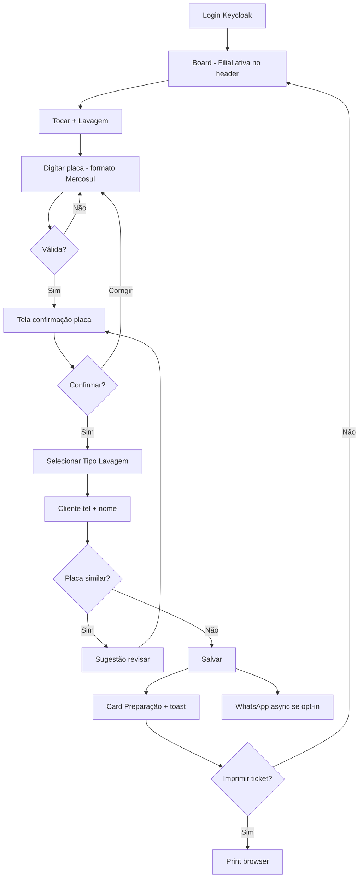
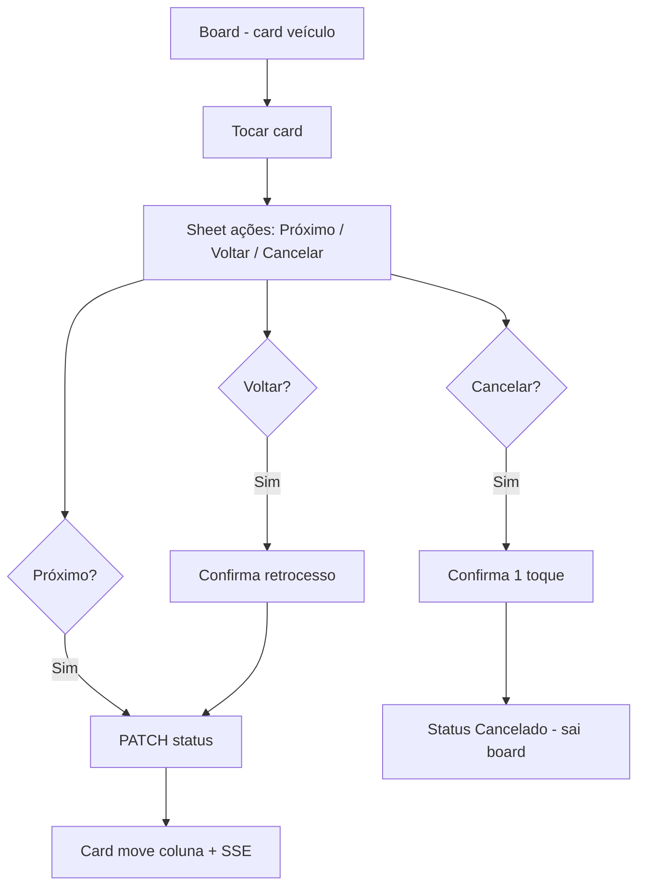
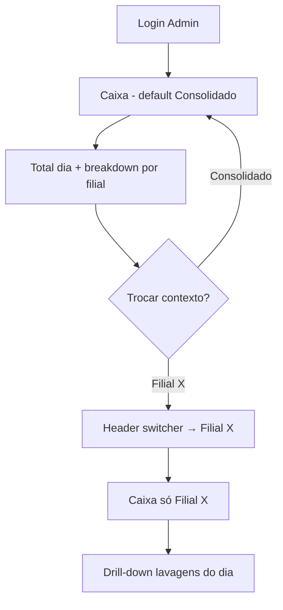
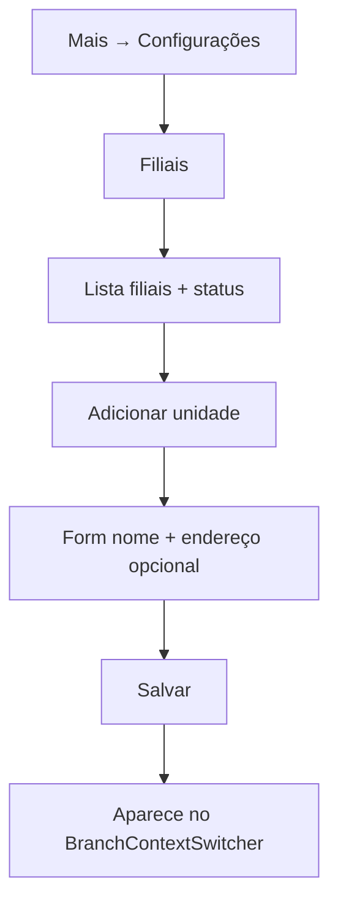

# UX Design Specification — Lava Rápido SaaS

**Autor:** Diego  
**Data:** 2026-05-21  
**Versão:** 1.0 (alinhada ao PRD revisão 3)

---

## Executive Summary

### Project Vision

O Lava Rápido é um SaaS multi-tenant para gestão operacional e financeira de lava-rápido automotivo. Cada **Tenant** (conta do dono) pode ter **1 ou N Filiais** (pontos físicos). A experiência deve ser **minimalista e premium soft**: poucos botões, linguagem simples, confiança sem intimidar quem não é técnico.

A interação definidora é **"ver a fila e mover carros"** — o Board de Status é a home; tudo mais (caixa, configurações, clientes) fica em navegação secundária.

### Target Users

| Persona | Contexto | Dispositivo | Prioridade UX |
|---------|----------|-------------|---------------|
| **Carlos — Operador** | Na pista, fila cheia, 4G instável, mãos molhadas | Web mobile / tablet (MVP); app nativo Fase 2 | Velocidade, placa sem erro, 1 filial fixa |
| **Ana — Proprietária (Admin)** | Após expediente ou entre unidades; 1–3 pontos | Web desktop/tablet | Visão consolidada + drill-down por filial |
| **Gerente** | Supervisiona operação | Web + mobile | Mesmo board + caixa; acesso configurável |
| **Admin config** | Cadastra tipos, filiais, equipe | Web | Formulários simples, poucos passos |

### Key Design Challenges

1. **Multi-filial sem complexidade** — seletor Filial/Consolidado visível mas não intrusivo; operador nunca "se perde" entre unidades.
2. **Velocidade operacional** — registrar carro em ≤45s (SM-1); máx. 3–4 CTAs na home.
3. **Placa Mercosul** — validação + confirmação visual antes de persistir; sugestão de duplicata.
4. **Ambiente hostil** — sol, barulho, pressa; touch targets ≥48px; ícones **com** rótulo curto.
5. **Dois modos de uso** — operador (1 filial, ação) vs. dono (consolidado, leitura).

### Design Opportunities

1. **Seletor de contexto unificado** — um componente `BranchContextSwitcher` serve operador (filial) e admin (consolidado + filiais).
2. **Board Kanban como produto** — colunas do Pipeline são a identidade visual; cards com profundidade, placa em destaque tipo "tag Mercosul".
3. **Caixa com toggle Consolidado/Filial** — mesmo padrão visual do board resumo; drill-down em ≤2 toques (FR-29).
4. **Premium operacional** — poucos botões, mas acabamento de produto SaaS de alto nível (camadas, tipografia, motion) — **não** visual de planilha ou app genérico.

> **Nota de direção (Diego):** simplicidade operacional ≠ visual cru. O app deve parecer **premium soft** — confiante, refinado, acolhedor — mesmo com 3–4 CTAs na home.

---

## Core User Experience

### Defining Experience

**"Abrir o app e ver onde está cada carro — e colocar o próximo na fila em segundos."**

Loop operacional:
1. Ver Board (colunas: Preparação → Lavando → Finalização → Pronto)
2. Nova lavagem — CTA **"+ Lavagem"** (FAB ou primário)
3. Confirmar placa → tipo → cliente → salvar
4. Mover status com 1 toque no card

Para Ana (admin): **"Ver quanto faturou hoje — total e por unidade — sem planilha."**

### Platform Strategy

| Superfície | MVP | Papel UX |
|------------|-----|----------|
| **Web responsivo** | Sim | Operacional na pista (mobile viewport) + admin desktop |
| **Mobile nativo (Expo)** | Fase 2 | Mesmos fluxos; filial fixa ou seletor |
| **Desktop** | Sim | Admin, caixa consolidado, configurações |

**Mobile-first operacional:** layouts desenhados primeiro para 390px (iPhone) e tablet 768px; desktop expande board e caixa side-by-side.

**Offline:** Fase 2 — MVP assume rede; UI não promete sync offline.

### Effortless Interactions

- **Avançar status:** toque no card → botão "Próximo" ou swipe horizontal (Fase 2 mobile).
- **Placa:** teclado alfanumérico otimizado; auto-formato Mercosul enquanto digita.
- **Cliente recorrente:** busca por telefone preenche nome automaticamente.
- **Contexto de filial:** operador não escolhe filial a cada ação — filial fixa na sessão.
- **Consolidado:** default para admin em Caixa e Dashboard; lembrar última seleção.

### Critical Success Moments

| Momento | Sensação desejada | Gatilho |
|---------|-------------------|---------|
| Carro na coluna Preparação | "Pronto, próximo" | Card aparece ≤3s |
| Placa confirmada | "Não errei" | Tela de confirmação grande |
| Carro em Pronto | "Fila sob controle" | Card na coluna + contador |
| Caixa consolidado | "Sei quanto ganhei" | Total do dia visível sem scroll |
| Drill-down filial | "Esta unidade está ok" | 1 toque no seletor |

### Experience Principles

1. **Board first** — home autenticada = Board; nunca dashboard genérico para operador.
2. **Uma UI só** — sem Modo Pista, sem modos automáticos por volume.
3. **Contexto explícito** — filial/consolidado sempre visível no header quando relevante.
4. **Confirmar o crítico** — placa e cancelamento exigem confirmação; resto é rápido.
5. **Português humano** — erros e labels sem jargon técnico.

---

## Desired Emotional Response

### Primary Emotional Goals

- **Controle calmo** — fila visível, nada escondido em submenu.
- **Confiança** — placa confirmada, caixa fechado, números claros.
- **Profissionalismo acessível** — premium soft, não ERP corporativo.

### Emotional Journey Mapping

| Fase | Operador | Admin |
|------|----------|-------|
| Login | Alívio ("já estou no board") | Orientação (contexto filial/consolidado) |
| Operação | Fluxo, foco | Supervisão leve |
| Erro placa | Correção sem culpa | — |
| Fim do dia | Satisfação | Clareza financeira |

### Micro-Emotions

Priorizar: **Confiança > Confusão**, **Eficiência > Ansiedade**, **Realização > Frustração**.

Evitar: sensação de ERP, medo de errar placa irreversível, perder-se entre filiais.

### Design Implications

| Emoção | UX |
|--------|-----|
| Controle | Board sempre visível; badge de fila |
| Confiança | Confirmação placa full-screen; totais de caixa destacados |
| Calma | Paleta soft, espaçamento generoso nos cards |
| Profissionalismo | Tipografia limpa, sem decoração excessiva |

### Emotional Design Principles

- Feedback imediato em toda ação (toast curto, animação sutil de card).
- Nunca bloquear operação por falha de WhatsApp ou impressão.
- Consolidado = sensação de "visão do dono"; individual = "sou gerente desta unidade".

---

## UX Pattern Analysis & Inspiration

### Inspiring Products Analysis

| Produto | Padrão útil | Aplicação Lava Rápido |
|---------|-------------|------------------------|
| **Trello / Notion boards** | Colunas + drag | Board de Status |
| **Square / SumUp POS** | Checkout rápido, poucos passos | Fluxo entrar carro |
| **Stripe Dashboard** | Métricas claras, drill-down | Caixa consolidado |
| **iFood Merchant** | Operação mobile, fila de pedidos | Board na pista |

### Transferable UX Patterns

**Navegação:** bottom bar mobile (Board | Lavagem | Caixa | Mais); sidebar colapsada desktop para admin.

**Interação:** FAB "+ Lavagem" no board; sheet/modal full-screen para registro.

**Visual:** cards com hierarquia placa > serviço > cliente; status por cor de coluna (sutil).

**Multi-unidade:** padrão "workspace switcher" (Slack, Notion) → `BranchContextSwitcher`.

### Anti-Patterns to Avoid

- ERP com 12 itens no menu lateral.
- Kanban denso com texto 10px.
- Seletor de filial escondido em Configurações.
- Ícones sem label na operação.
- Modo escuro automático na pista (Fase 2: toggle manual "modo sol").

### Design Inspiration Strategy

**Adotar:** Kanban operacional, workspace switcher, POS linear para entrada.

**Adaptar:** consolidado como opção no switcher (não só lista de filiais).

**Evitar:** dashboards com 20 widgets; wizard de 8 passos para entrar carro.

---

## Design System Foundation

### Design System Choice

**shadcn/ui 4.x + Tailwind CSS 4** (Next.js web).

Sistema **themeable**: componentes Radix acessíveis, tokens customizáveis para premium soft.

### Rationale for Selection

- Já definido em `project-context.md` e stack do projeto.
- Velocidade de MVP com qualidade acessível (Radix).
- Customização de tokens (cores PRD §9) sem fork de biblioteca.
- Mobile: React Native Paper ou NativeWind na Fase 2 — tokens compartilhados em `packages/shared`.

### Implementation Approach

- Tokens CSS em `apps/web` (ou `packages/shared/tokens`).
- Componentes shadcn instalados sob demanda; custom components em `components/ops/`.
- Storybook opcional Fase 2; MVP: documentação neste spec.

### Customization Strategy

- Override `--primary`, `--background`, `--accent` com paleta §9.
- Border-radius generoso (8–12px) para soft feel.
- Shadows leves; evitar bordas duras pretas.

---

## Defining Core Interaction

### 2.1 Defining Experience

**Operador:** "Tocar + Lavagem e ver o carro no board."

**Admin:** "Alternar consolidado ↔ filial e entender o dia."

### 2.2 User Mental Model

Operadores pensam em **"fila física"** — colunas = etapas do lava-rápido. Donos pensam em **"caixa do dia"** e **"qual unidade rendeu mais"**.

### 2.3 Success Criteria

- Entrada completa ≤45s mediana (SM-1).
- Board reflete mudança ≤2s p95 (NFR).
- Admin alterna contexto em 1 toque.
- Zero telas sem filial explícita para operador.

### 2.4 Novel UX Patterns

Majoritariamente **estabelecidos** (Kanban + workspace switcher). Twist: opção **"Todas as unidades"** no mesmo controle de filial, agregando board resumo (contadores por coluna) em vez de cards misturados no MVP.

### 2.5 Experience Mechanics — Nova lavagem (UJ-1)

**1. Initiation:** CTA "+ Lavagem" (FAB mobile / botão primário header desktop).

**2. Interaction:** Sheet full-screen → campo placa (auto-formato) → validação Mercosul → tela confirmação placa grande → select tipo lavagem → cliente (tel + nome, busca) → opt-in WhatsApp se novo → Salvar.

**3. Feedback:** Toast "Carro na fila"; card anima para coluna Preparação; oferta imprimir ticket.

**4. Completion:** Retorno ao board; badge fila incrementa.

---

## Visual Design Foundation

### Design Philosophy — Premium Soft Operacional

| Princípio | Significa | Não significa |
|-----------|----------|---------------|
| **Premium** | Camadas, sombras suaves, tipografia cuidada, motion polida | Mais menus ou mais passos |
| **Soft** | Bordas arredondadas 12–16px, cores dessaturadas, respiro | Infantil ou sem contraste |
| **Operacional** | Placa legível ao sol, 48px touch, 3–4 CTAs | ERP denso ou dashboard genérico |

**Referências de tom (não de layout):** refinamento do Linear, cards do Apple Weather, clareza do Stripe — aplicados a um board de pista.

### Color System

Paleta base PRD §9, estendida com profundidade e gradientes sutis.

| Token | Hex / valor | Uso |
|-------|-------------|-----|
| `primary` | `#2B5F8C` | Marca, CTAs primários |
| `primary-deep` | `#1A3D5C` | Header gradiente, texto em fundos claros |
| `primary-glow` | `rgba(43,95,140,0.12)` | Halo em FAB e focus |
| `background` | `#F4F7FA` | Base app |
| `background-gradient` | `linear-gradient(165deg, #F7F9FB 0%, #EEF3F8 50%, #E8EEF4 100%)` | Fundo board (fixo, sutil) |
| `accent` | `#5BA88C` | Pronto, confirmações, badges positivos |
| `accent-soft` | `rgba(91,168,140,0.14)` | Fundo chip "Pronto" |
| `surface` | `#FFFFFF` | Cards |
| `surface-glass` | `rgba(255,255,255,0.72)` + `backdrop-blur: 16px` | Header, bottom nav, sheets |
| `surface-elevated` | `#FFFFFF` + shadow elev. | Cards hover, modais |
| `muted` | `#E2E9F0` | Separadores |
| `border-subtle` | `rgba(43,95,140,0.08)` | Bordas cards/colunas |
| `warning` | `#C4922A` | Atenção placa similar |
| `destructive` | `#C44B4B` | Cancelar |
| `text` | `#152535` | Corpo |
| `text-muted` | `#5A6B7C` | Secundário |

**Ambient tint por coluna** (fundo da coluna, 4–6% opacidade da cor de status):

| Coluna | Tint | Accent bar (topo card) |
|--------|------|------------------------|
| Preparação | `#2B5F8C` | gradient 2px |
| Lavando | `#4A90C2` | gradient 2px |
| Finalização | `#7B6BA8` | gradient 2px |
| Pronto | `#5BA88C` | gradient 2px + glow sutil |

**Elevação (shadow tokens):**

```css
--shadow-sm: 0 1px 2px rgba(21,37,53,0.04);
--shadow-md: 0 4px 16px rgba(43,95,140,0.08), 0 1px 3px rgba(21,37,53,0.04);
--shadow-lg: 0 12px 40px rgba(43,95,140,0.12), 0 4px 12px rgba(21,37,53,0.06);
--shadow-fab: 0 8px 24px rgba(43,95,140,0.28);
```

Contraste WCAG AA mantido; glass só em header/nav (nunca atrás de texto crítico da placa).

### Typography System

| Papel | Fonte | Peso | Notas |
|-------|-------|------|-------|
| **UI** | **Plus Jakarta Sans** | 400–600 | Premium, arredondada, legível ao sol |
| **Placa / números** | **DM Mono** ou tabular nums | 500–600 | Evoca placa Mercosul sem parecer sistema |
| **Display momentos** | Plus Jakarta Sans | 700 | Confirmação placa, totais caixa |

**Escala tipográfica:**

| Token | Size | Uso |
|-------|------|-----|
| `display-plate` | 36px / 40px mobile | Tela confirmação placa |
| `title-lg` | 24px | Totais caixa |
| `title-md` | 18px | Título coluna board |
| `body` | 16px | Labels, cliente |
| `caption` | 13px | Tempo na coluna, meta |
| `micro` | 11px | Badges uppercase tracking +0.04em |

**Placa no card:** DM Mono 18px semibold, letter-spacing 0.06em, dentro de chip estilo placa (fundo `#F0F4F8`, borda `border-subtle`, radius 8px).

### Spacing & Layout Foundation

- Base **8px**; touch targets **48px** mínimo.
- Board: colunas **280px** desktop / **260px** mobile; gap **16px**; padding coluna **12px**.
- Cards: padding **16px 18px**; radius **14px**; gap interno **10px**.
- Header **64px** com glass; bottom nav **72px** + safe-area.
- **Respiro premium:** mais ar entre cards que entre colunas — fila "respira", não parece lista comprimida.

### Motion & Micro-interactions

| Ação | Motion | Duração |
|------|--------|---------|
| Card muda coluna | slide + scale 0.98→1 | 280ms spring |
| Novo card entra | fade-up + shadow grow | 320ms |
| Sheet entrar carro | slide-up + backdrop blur 12px | 350ms ease-out |
| FAB press | scale 0.96 + shadow reduce | 120ms |
| Badge fila update | número count-up | 200ms |
| Toast | slide-in bottom | 250ms |

`prefers-reduced-motion`: instantâneo, sem spring.

### Accessibility Considerations

- Ícones operacionais sempre com label.
- Focus ring: 2px `primary-glow` + offset 2px.
- Status: cor + label + ícone na coluna.
- Glass: fallback sólido `#FFFFFF` se `backdrop-filter` indisponível.

---

## Design Direction Decision

### Design Directions Explored

| Dir | Descrição | Veredicto |
|-----|-----------|-----------|
| **A — Board Hero Premium** | Board full viewport com camadas glass, cards elevados, placa estilo Mercosul, header gradiente | **Escolhida** |
| A-v0 (simples) | Kanban flat, header sólido | Revisada — **insuficiente para premium** |
| B — Dashboard first | Resumo numérico antes do board | Rejeitada (operador) |
| C — Lista densa | Lista única sem colunas | Rejeitada (mental model fila) |
| D — ERP sidebar | Menu lateral 10+ itens | Rejeitada (Non-Goal) |

### Chosen Direction

**A — Board Hero Premium Soft**

```
┌─────────────────────────────────────────────────────────────┐
│ ░░ glass header — gradiente primary-deep → primary ░░░░░░░ │
│  [logo mark]   Unidade Centro ▾     ◉ 8 na fila    [avatar] │
├─────────────────────────────────────────────────────────────┤
│ ░ background gradient sutil + colunas com ambient tint ░░░ │
│  ┌─ Preparação ─┐ ┌─ Lavando ────┐ ┌─ Finaliz. ─┐ ┌ Pronto┐│
│  │ chip count 3 │ │ chip count 5 │ │ ...        │ │ ✓ glow││
│  │ ┌──────────┐ │ │ ┌──────────┐ │              │ │ card  ││
│  │ │ ABC1D23  │ │ │ │ XYZ9K87  │ │              │ │       ││
│  │ │ Completa │ │ │ │ Simples  │ │              │ │       ││
│  │ │ · 12 min │ │ │ │ · 8 min  │ │              │ │       ││
│  │ └──────────┘ │ │ └──────────┘ │              │ │       ││
│  └──────────────┘ └──────────────┘              └────────┘│
│                    ╭──────────────────╮                      │
│                    │  + Lavagem       │  ← FAB gradient    │
│                    ╰──────────────────╯                      │
├─────────────────────────────────────────────────────────────┤
│ ░░ glass bottom nav — ícone + label ░░░░░░░░░░░░░░░░░░░░░░ │
└─────────────────────────────────────────────────────────────┘
```

**Camadas visuais (z-index):**
1. Background gradient (fixo)
2. Colunas com tint + borda `border-subtle`
3. Cards `surface-elevated` + accent bar gradient no topo
4. Header / bottom nav glass
5. Sheets e modais `shadow-lg`

**Header:** gradiente `#1A3D5C → #2B5F8C`; switcher como pill glass branco; badge fila com pulse sutil.

**FAB "+ Lavagem":** gradiente primary, `shadow-fab`, ícone + label (nunca só ícone).

**Bottom nav mobile:** glass, ícones Lucide stroke 1.5 + label 11px; item ativo = pill accent-soft.

**Admin consolidado:** mesmas colunas, cards substituídos por **stat tiles** premium (número grande Plus Jakarta 700 + label filial); tile clicável → board da filial.

### Design Rationale

- Mantém FR-7 (board home, 3–4 CTAs) com **identidade visual forte**.
- Premium percebido via **tipografia, profundidade e placa hero** — não via features extras.
- Glass e gradientes contidos — legibilidade ao sol preservada (texto sempre em surface sólida).

### Implementation Approach

- Tokens em CSS variables + Tailwind `@theme`.
- Fontes: `next/font` — Plus Jakarta Sans + DM Mono.
- shadcn components com override de radius (`--radius: 0.875rem`) e shadows custom.
- Wireframes hi-fi: Board premium, Confirmação placa (placa 40px estilo Mercosul), Caixa com stat cards.

---

## User Journey Flows

### UJ-1 — Operador registra carro



### UJ-2 — Mover status no Pipeline



### UJ-3 — Proprietária: caixa consolidado e por filial



### UJ-5 — Admin cadastra filial



### Journey Patterns

- **Contexto persistente:** `BranchContextSwitcher` no header em Board, Caixa, Dashboard resumo.
- **Confirmação destrutiva:** sheet bottom com botão vermelho explícito (cancelar).
- **Progressive disclosure:** detalhes do card em sheet; board limpo.

### Flow Optimization Principles

- Máx. 5 telas no fluxo entrar carro (incl. confirmação placa).
- Admin: consolidado como default; filial a 1 toque.
- Sempre mostrar filial ativa no header operacional.

---

## Component Strategy

### Design System Components (shadcn)

Button, Input, Select, Sheet, Dialog, Toast, Badge, Card, Tabs, DropdownMenu, Avatar, Separator, Skeleton.

### Custom Components

#### BranchContextSwitcher

**Purpose:** Selecionar Filial ou visão Consolidado (admin).  
**Anatomy:** Pill glass (`surface-glass`, radius full, padding 8px 14px) com ícone pin + nome + chevron; dropdown com mesma linguagem visual — item ativo com accent-soft.  
**States:** default, open (shadow-lg dropdown), loading filiais, single-branch (pill estático sem chevron).

#### VehicleEntryCard

**Purpose:** Representar carro no board — **peça visual central do produto**.  
**Anatomy:**
- Barra gradient 3px no topo (cor da coluna)
- **PlateChip** — DM Mono, fundo `#F0F4F8`, padding 6px 10px, simula placa
- Tipo lavagem — caption muted + ícone serviço (gota/sparkle)
- Cliente — primeiro nome + tel truncado
- **TimeChip** — "12 min" em micro uppercase, canto inferior direito
**States:** default (`shadow-md`), hover (`shadow-lg` + translateY -1px), dragging (Fase 2), updating (shimmer skeleton).  
**Pronto column:** accent-soft glow no card (`box-shadow` accent 8%).

#### PlateConfirmScreen

**Purpose:** FR-5 — momento **hero** do app.  
**Anatomy:** fundo gradient sutil; placa em **display-plate** 40px dentro de frame estilo Mercosul (borda dupla, cantos 12px, largura max 320px); pergunta "Está correto?" title-md; botões full-width stacked — Confirmar (gradient primary), Corrigir (ghost).

#### BoardColumn

**Purpose:** Coluna Kanban premium.  
**Anatomy:** fundo ambient tint 5%; radius 16px; padding 12px; header com ícone status + title-md + **CountPill** (glass branco, número bold).  
**Empty:** ilustração line-art minimal (carro outline) + "Nenhum carro aqui" — não texto seco alone.

#### CashRegisterSummary

**Purpose:** Caixa dia (FR-15, FR-29).  
**Anatomy:** Toggle Consolidado/Filial | Total | lista entradas | saldo.  
**Consolidado:** cards por filial clicáveis → drill-down.

#### QueueBadge

**Purpose:** Contador fila (FR-7).  
**Placement:** header ao lado do switcher.

### Component Implementation Strategy

Custom em `apps/web/components/ops/`; tokens shared; testes visuais manuais MVP.

### Implementation Roadmap

| Fase | Componentes |
|------|-------------|
| MVP P0 | BranchContextSwitcher, BoardColumn, VehicleEntryCard, PlateConfirmScreen, QueueBadge |
| MVP P1 | CashRegisterSummary, WashTypeSelect, CustomerQuickForm |
| Fase 2 | OfflineQueueIndicator, PhotoCapture |

---

## UX Consistency Patterns

### Button Hierarchy

| Nível | Uso | Estilo |
|-------|-----|--------|
| Primário | + Lavagem, Confirmar placa, Salvar | `primary` filled, full-width mobile |
| Secundário | Corrigir, Voltar | outline |
| Destrutivo | Cancelar atendimento | `destructive`, requer confirmação |
| Ghost | Fechar sheet | text only |

Máx. **1 primário** por tela.

### Feedback Patterns

- **Sucesso:** toast 3s bottom (accent).
- **Erro:** inline no campo + toast se global; mensagem em português claro.
- **Loading:** skeleton no card; spinner no botão primário.
- **Async (WhatsApp):** toast info "Enviando mensagem…" não bloqueia.

### Form Patterns

- Labels acima do campo; placeholder como exemplo (ABC1D23).
- Validação on blur para placa; on submit para resto.
- Teclado tel para telefone; uppercase placa.

### Navigation Patterns

**Mobile operador:** Bottom nav 4 itens — Board | Lavagem | Caixa | Mais.

**Desktop admin:** Sidebar colapsada — Board | Caixa | Clientes | Config (Tipos, Filiais, Equipe).

**Header global:** BranchContextSwitcher sempre visível (exceto login).

### Additional Patterns

**Empty board:** Ilustração leve + "Nenhum carro na fila" + CTA "+ Lavagem".

**Loading board:** 3 skeleton cards por coluna.

**Consolidado board (admin):** Não mistura cards de filiais no MVP — mostra **resumo por coluna** (números) + link "Ver board da filial X".

---

## Responsive Design & Accessibility

### Responsive Strategy

| Breakpoint | Layout |
|------------|--------|
| **Mobile** 320–767px | Board scroll horizontal; bottom nav; FAB entrar |
| **Tablet** 768–1023px | 4 colunas board; switcher no header |
| **Desktop** 1024px+ | Board + painel lateral opcional (detalhe card); sidebar admin |

### Breakpoint Strategy

Tailwind defaults: `sm` 640, `md` 768, `lg` 1024, `xl` 1280. Mobile-first.

### Accessibility Strategy

**WCAG 2.1 AA** alvo.

- Contraste 4.5:1 texto normal.
- Touch 48×48px mínimo.
- Navegação por teclado no web admin.
- `aria-label` em FAB e ações de card.
- Screen reader: coluna anunciada ao mover card.

### Testing Strategy

- Teste manual iPhone SE + Android médio.
- axe DevTools no web.
- Teste sol/glare: contraste alto (Fase 2 toggle).

### Implementation Guidelines

- `rem` para tipografia; `%`/`fr` para grid board.
- `prefers-reduced-motion`: desabilitar animações de card.
- Header sticky; safe-area-inset mobile.

---

## Information Architecture

```
App (autenticado)
├── Header [BranchContextSwitcher | QueueBadge | User]
├── Board (home operador / resumo admin consolidado)
├── Nova lavagem (sheet/modal — CTA "+ Lavagem")
├── Caixa
│   ├── Consolidado (default admin)
│   └── Por filial
├── Clientes (busca tel, histórico multi-filial)
└── Mais / Config
    ├── Tipos de lavagem
    ├── Filiais
    ├── Equipe (Fase 2 RBAC config)
    └── Conta / Sair
```

---

## Screen Inventory (MVP)

| Tela | Persona | Prioridade |
|------|---------|------------|
| Board (filial) | Operador | P0 |
| Board resumo (consolidado) | Admin | P0 |
| Nova lavagem (fluxo) | Operador | P0 |
| Confirmação placa | Operador | P0 |
| Caixa consolidado / filial | Admin | P0 |
| Lista filiais + form | Admin | P0 |
| Tipos lavagem CRUD | Admin | P1 |
| Clientes | Operador/Admin | P1 |
| Login (Keycloak redirect) | Todos | P0 |

---

## Next Workflow

| Workflow | Input deste doc |
|----------|-----------------|
| `bmad-check-implementation-readiness` | PRD + UX + Architecture + epics.md |
| Implementação | Epic 1 Story 1.1 — scaffold monorepo |
| Implementação web | Tokens §Visual, Board Hero direction |
| Figma (opcional) | Screen inventory + flows Mermaid |

---

## Referências

- PRD revisão 3: `prds/prd-lava-rapido-2026-05-21/prd.md`
- Arquitetura ADR-009 multi-filial: `architecture.md`
- Visual explorations: `ux-design-directions.html`, `ux-color-themes.html`
